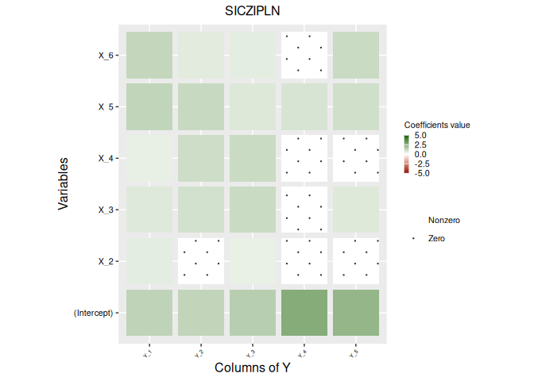

# Sparse Poisson Log Normal Model for Zero-Inflated Multivariate Count Data

## Description

This repository contains R source for implementing the analysis
described in the article “Sparse Poisson Log Normal Model for
Zero-Inflated Multivariate Count Data”. The analysis focuses on variable
selection and on providing useful/interpretable graphical outputs.

## Features

- Implementation of the smooth information criterion in the
  zero-inflated Poisson log-normal model.
- Pipeline analysis: modify the data file paths in the scripts to
  analyze different datasets.
- Demonstration scripts: show how to perform the entire analysis,
  including data preprocessing, model fitting, and extracting graphical
  results.

## Usage

### Installation

Install the development version from GitHub:

``` r
# [GitHub](https://github.com/kioye-jean-yves/SICZIPLN):
# install.packages("pak")
# pak::pak("kioye-jean-yves/SICZIPLN")
```

### Illustration

We illustrate variable selection on simulated data according to the
ZIPLN model, `data_ZIPLN_simulation`, with fixed parameters.

``` r
library(SICZIPLN)
data(data_ZIPLN_simulation)
```

The fixed parameters for the simulation are:

``` r
# Matrix of variance-covariance
data_ZIPLN_simulation$Sigma_simulatation
#>           species_1 species_2 species_3 species_4 species_5
#> species_1 3.0000000 1.5000000  0.750000 0.4330127  0.187500
#> species_2 1.5000000 3.0000000  1.500000 0.8660254  0.375000
#> species_3 0.7500000 1.5000000  3.000000 1.7320508  0.750000
#> species_4 0.4330127 0.8660254  1.732051 4.0000000  1.732051
#> species_5 0.1875000 0.3750000  0.750000 1.7320508  3.000000
```

``` r
# Coefficient matrix in the PLN part
data_ZIPLN_simulation$B_simulatation
#>      [,1] [,2] [,3] [,4] [,5]
#> [1,]    1    1  1.0  1.0    1
#> [2,]    1    0  0.8  1.0    1
#> [3,]    1    1  1.0  0.0    1
#> [4,]    1    1  1.0  0.5    1
#> [5,]    1    1  1.0  1.0    1
#> [6,]    1    1  1.0  1.0    1
```

``` r
# Coefficient matrix in the Zero-Inflation part
data_ZIPLN_simulation$B0_simulatation
#>      [,1] [,2] [,3] [,4] [,5]
#> [1,]    1    1    1    1    1
#> [2,]    1    0    0    1    1
#> [3,]    1    1    1    0    1
#> [4,]    1    1    1    1    1
#> [5,]    1    1    1    1    1
#> [6,]    1    1    1    1    1
```

The simulated data contain 1000 observations, 5 count variables
(species), and 6 covariates including the intercept, both in the PLN
part and in the zero-inflation part.

``` r
Y <- data_ZIPLN_simulation$Y
dim(Y)
#> [1] 1000    5
head(Y)
#>        Y_1 Y_2 Y_3 Y_4 Y_5
#> obs_1    0   0   0   0  21
#> obs_2    0   0   0   5   0
#> obs_3 1501   0   0   0   0
#> obs_4    0   0  62   0   0
#> obs_5    0   0 116   0   0
#> obs_6    0   5   0   0   0
```

``` r
X <- data_ZIPLN_simulation$X
dim(X)
#> [1] 1000    6
head(X)
#>       X_1       X_2        X_3       X_4       X_5        X_6
#> obs_1   1 0.3906417 0.90569898 0.7474143 0.3920979 0.01633730
#> obs_2   1 1.4311032 1.02468875 0.1326660 0.1861822 1.27891270
#> obs_3   1 1.0717628 0.24765672 0.7187732 0.1940118 0.38728054
#> obs_4   1 0.7946663 0.35340388 0.4962149 1.1837896 0.07872001
#> obs_5   1 0.1068507 0.02454568 0.4652361 0.4511392 1.20235377
#> obs_6   1 1.2803771 0.45503146 0.2881409 0.2940078 1.44877787
```

``` r
X_zero <- data_ZIPLN_simulation$X_zero
dim(X_zero)
#> [1] 1000    6
head(X_zero)
#>       X_zero_1  X_zero_2   X_zero_3  X_zero_4  X_zero_5   X_zero_6
#> obs_1        1 0.3906417 0.90569898 0.7474143 0.3920979 0.01633730
#> obs_2        1 1.4311032 1.02468875 0.1326660 0.1861822 1.27891270
#> obs_3        1 1.0717628 0.24765672 0.7187732 0.1940118 0.38728054
#> obs_4        1 0.7946663 0.35340388 0.4962149 1.1837896 0.07872001
#> obs_5        1 0.1068507 0.02454568 0.4652361 0.4511392 1.20235377
#> obs_6        1 1.2803771 0.45503146 0.2881409 0.2940078 1.44877787
```

#### SICZIPLN based on a fixed regularization level

A single, fixed regularization level (e.g. the SIC default,
$\lambda = \log n$), fit directly.

`optim_method`: allows you to choose the optimization algorithm for the
`nloptr` optimizer. The default is `NLOPT_LD_LBFGS`. Supported
algorithms include `NLOPT_LD_MMA`, `NLOPT_LD_CCSAQ`, `NLOPT_LD_VAR1`,
`NLOPT_LD_VAR2`, `NLOPT_LD_TNEWTON`, `NLOPT_LD_TNEWTON_RESTART`,
`NLOPT_LD_TNEWTON_PRECOND`, and `NLOPT_LD_TNEWTON_PRECOND_RESTART`.

`initialisation_method`: choice of starting parameters for `SICZIPLN`,
either from `ZIPLN` or from `LM`.

``` r
fit_SICZIPLN <- SICZIPLN(X = X[, -1], Y = Y, X_zero = X_zero[, -1],
                          lambda_fixed = log(nrow(X)),
                          grid_search = FALSE,
                          optim_method = "NLOPT_LD_LBFGS",
                          initialisation_method = "ZIPLN")
#> ***** Initialisation with ZIPLN and  NLOPT_LD_LBFGS  algorithm for the optimizer ***** 
#> *** Initialization is complete ***
# Estimated covariates coefficient matrix in PLN part
fit_SICZIPLN$model_par$B
#>                   Y_1       Y_2       Y_3       Y_4       Y_5
#> (Intercept) 1.3654101 1.3056070 1.5230661 2.6188096 2.3101472
#> X_2         0.5723316 0.0000000 0.4631831 0.0000000 0.0000000
#> X_3         0.6902621 0.9525062 1.1359384 0.0000000 0.6940973
#> X_4         0.4793839 1.0583072 1.1327523 0.0000000 0.0000000
#> X_5         1.3245711 1.1823373 0.7225658 0.8427817 1.0065169
#> X_6         1.2567862 0.6187011 0.5692713 0.0000000 1.1237149
# Estimated precision matrix in PLN part
fit_SICZIPLN$model_par$Omega
#>               Y_1           Y_2           Y_3           Y_4           Y_5
#> Y_1  3.944602e-01  3.373875e-05 -0.0046259032 -0.0015900775 -0.0016827336
#> Y_2  3.373875e-05  3.427701e-01 -0.0011170667  0.0004404927  0.0003485187
#> Y_3 -4.625903e-03 -1.117067e-03  0.4341118277 -0.0008496131 -0.0016539458
#> Y_4 -1.590078e-03  4.404927e-04 -0.0008496131  0.3184944279 -0.0021013055
#> Y_5 -1.682734e-03  3.485187e-04 -0.0016539458 -0.0021013055  0.3755883006
# Estimated covariates coefficient matrix in ZI part
fit_SICZIPLN$model_par$B_zero
#>                    Y_1          Y_2         Y_3         Y_4        Y_5
#> (Intercept)  0.7694111  1.119070650  1.21794417  1.17966515 0.43361647
#> X_zero_2     0.7696453 -0.544373652 -0.76551893  0.62181377 1.07342076
#> X_zero_3     0.6360165  0.317157397  0.22580582 -1.07231796 0.68521079
#> X_zero_4     0.1740664  0.082335993  0.01924959  0.06995568 0.23571126
#> X_zero_5     0.1532850  0.001573009  0.09329651  0.16401919 0.01386412
#> X_zero_6    -0.2555786  0.106646846  0.02384204  0.34679669 0.39725396
```

##### Estimated covariate coefficient (penalized) matrix in the PLN part

``` r
fit_SICZIPLN$model_par$B
#>                   Y_1       Y_2       Y_3       Y_4       Y_5
#> (Intercept) 1.3654101 1.3056070 1.5230661 2.6188096 2.3101472
#> X_2         0.5723316 0.0000000 0.4631831 0.0000000 0.0000000
#> X_3         0.6902621 0.9525062 1.1359384 0.0000000 0.6940973
#> X_4         0.4793839 1.0583072 1.1327523 0.0000000 0.0000000
#> X_5         1.3245711 1.1823373 0.7225658 0.8427817 1.0065169
#> X_6         1.2567862 0.6187011 0.5692713 0.0000000 1.1237149
```

##### Plot of Estimated covariate coefficient (penalized) matrix in the PLN part

``` r
library(ggplot2)
library( ggpattern)
library( reshape2)
coef_graph<-SICZIPLN::coef_plot_barre(fit_SICZIPLN$model_par$B,
                            nom_axes = c("Columns of Y", "Variables",
                                         "Coefficients value", "SICZIPLN"),
                            grad_echelle = c(-5, 5))
coef_graph
```



##### Estimated precision matrix (unpenalized) in PLN part

``` r
fit_SICZIPLN$model_par$Omega
#>               Y_1           Y_2           Y_3           Y_4           Y_5
#> Y_1  3.944602e-01  3.373875e-05 -0.0046259032 -0.0015900775 -0.0016827336
#> Y_2  3.373875e-05  3.427701e-01 -0.0011170667  0.0004404927  0.0003485187
#> Y_3 -4.625903e-03 -1.117067e-03  0.4341118277 -0.0008496131 -0.0016539458
#> Y_4 -1.590078e-03  4.404927e-04 -0.0008496131  0.3184944279 -0.0021013055
#> Y_5 -1.682734e-03  3.485187e-04 -0.0016539458 -0.0021013055  0.3755883006
```

##### Estimated covariates coefficient (unpenalized) matrix in ZI part

``` r
fit_SICZIPLN$model_par$B_zero
#>                    Y_1          Y_2         Y_3         Y_4        Y_5
#> (Intercept)  0.7694111  1.119070650  1.21794417  1.17966515 0.43361647
#> X_zero_2     0.7696453 -0.544373652 -0.76551893  0.62181377 1.07342076
#> X_zero_3     0.6360165  0.317157397  0.22580582 -1.07231796 0.68521079
#> X_zero_4     0.1740664  0.082335993  0.01924959  0.06995568 0.23571126
#> X_zero_5     0.1532850  0.001573009  0.09329651  0.16401919 0.01386412
#> X_zero_6    -0.2555786  0.106646846  0.02384204  0.34679669 0.39725396
```

#### SICZIPLN based on a grid of regularization levels

`grid_search = TRUE`: explore a grid of penalties in parallel and select
the best one by BIC.

``` r
# #| cache: true
# fit_grid_SICZIPLN <- SICZIPLN(X = X[, -1], Y = Y, X_zero = X_zero[, -1],
#                                grid_search = TRUE, length_lambda = 100,
#                                optim_method = "NLOPT_LD_LBFGS")
# fit_grid_SICZIPLN$best_lambda
```

## Author

[Kioye Togo Jean Yves](https://github.com/kioye-jean-yves/)

## License

This project is licensed under a [Creative Commons
License](https://creativecommons.org/) allowing free reuse of the
research work.

## References
